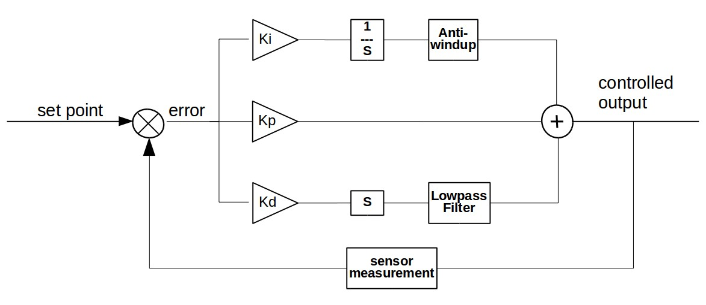

# PID Controller

PID controller written in C++ with anti-windup and output clamping to ensure system stability.

## PID System
The following image shows an overview of the system that is implemeted

## Parameters
The pidSMDSystem class is implemeted with the following parameters

`kp` - proportial gain of the system.

`ki` - integral gain of the system.

`kd` - derivative gain of the system.

`tau` - time constant for low pass filter. You can alternatively set the `cutoff` frequency for the filter.

`sampling_time` - sampling time to discretize the continuous system.

`max_int_limit` - upper limit for anti-windup in integral limit.

`min_int_limit` - lower limit for anti-windup in integral limit.

`system_max` - maximum system output to clamp the values to avoid system misbehaviour.

`system_min` - minimum system output to clamp the values to avoid system misbehaviour.